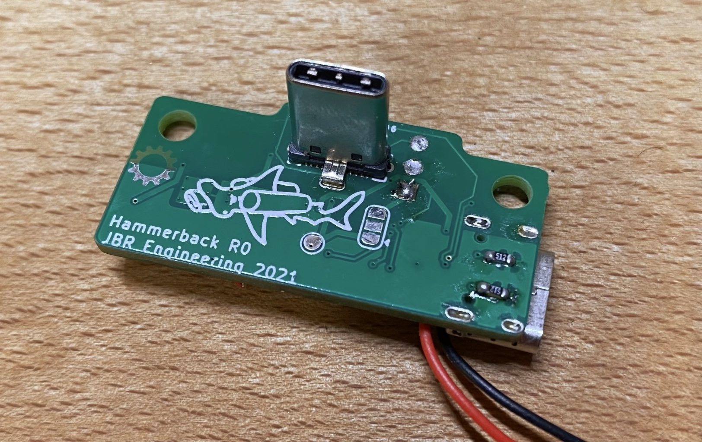
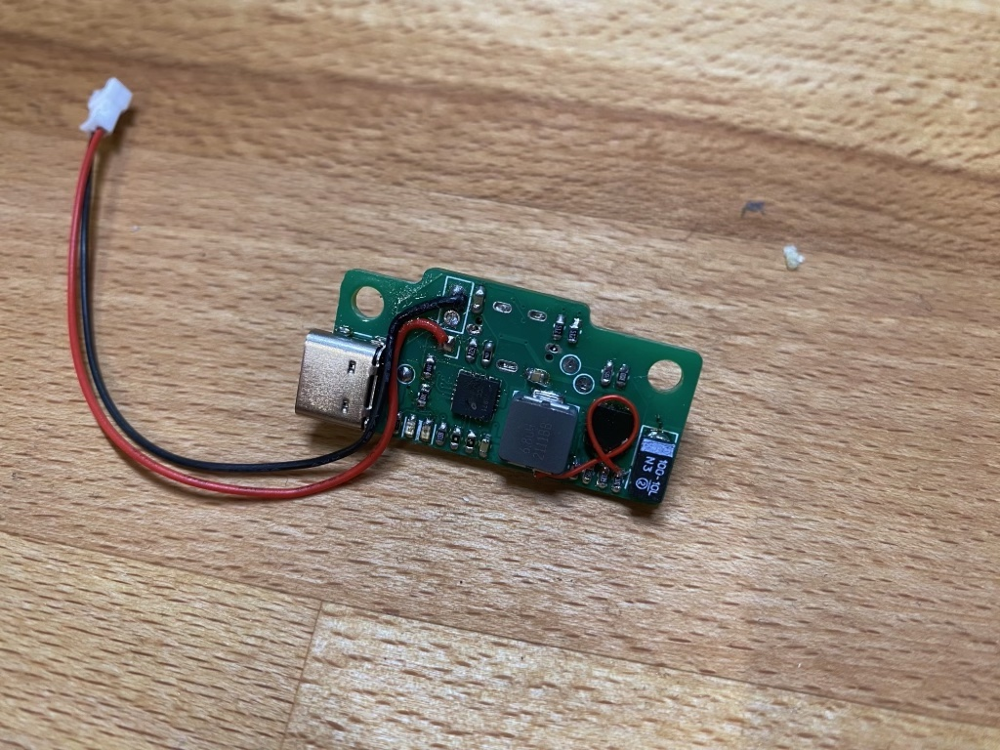
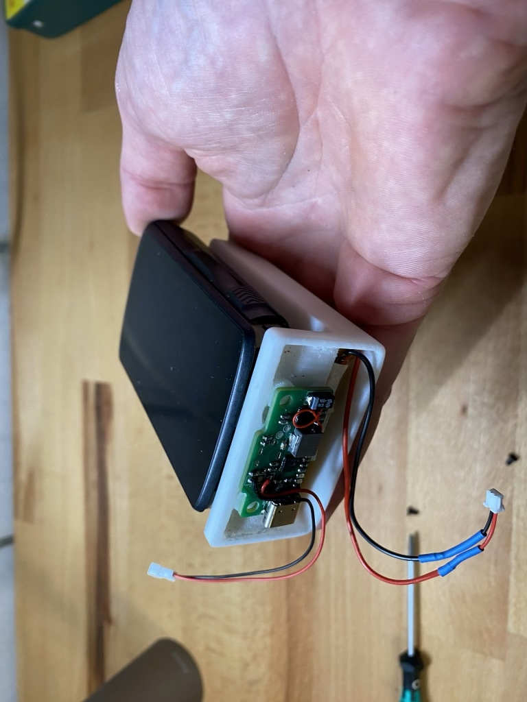
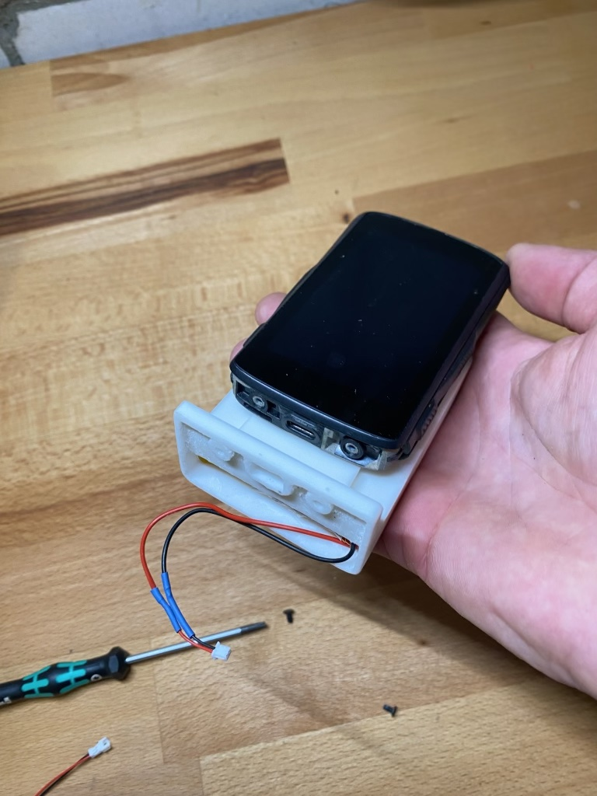
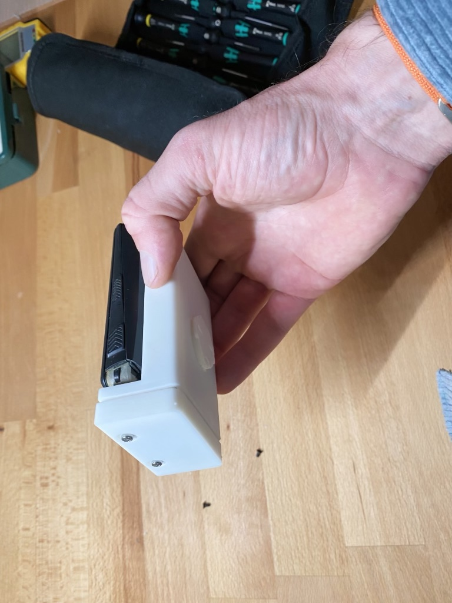

# Hammerback - Battery Backpack for Hammerhead Karoo 2

A quick prototype to expand the battery of the Hammerhead Karoo 2 by attaching a larger battery between the device and handlebar mount.

It is essentially a [Adafruit Powerboost 1000C](https://www.adafruit.com/product/2465) in a layout with vertical USB-C to the Karoo 2 and a side USB-C for charging. The _backpack_ contains a LiPo (that connects to the PCB), Karoo 2 style mount and quarter turn at the base for attaching to bike. It is secured by taking the place of the USB-C cover plate with extended T8 screws.

## Photos

**Not my best soldering!**

**Made some nice silkscreen art 😁**

## Project State

I put this together quickly as an idea. Whilst it worked in principle, it could do with some refining. I also have other ideas that could be included:

* Illumination - use the LiPo as a supply for a small front light if a transparent backpack is used.
* Switch for turning on/off. Currently it will supply the Karoo until the LiPo is empty or one must to remove it.
* The design could also be simplified to simply be the vertical USB-C to Karoo, with a header for a 5 V source - this could be used with an existing battery pack rather so using that BMS/charging rather than on-board.

# Mechanicals

[Fusion 360 design](https://a360.co/3pR5RNK)

# Disclaimer

It should be obvious but this is supplied without warranty and to be used at user's discretion. Always be careful when using LiPo cells. I cannot guarantee the working state of this.
